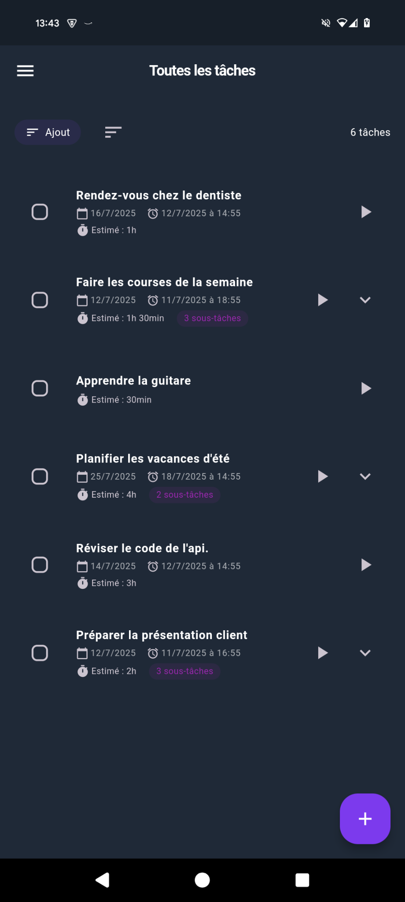
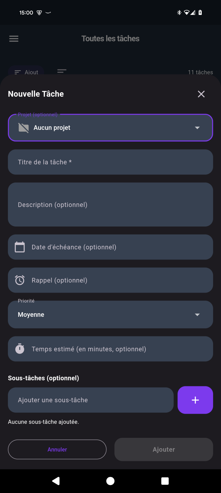
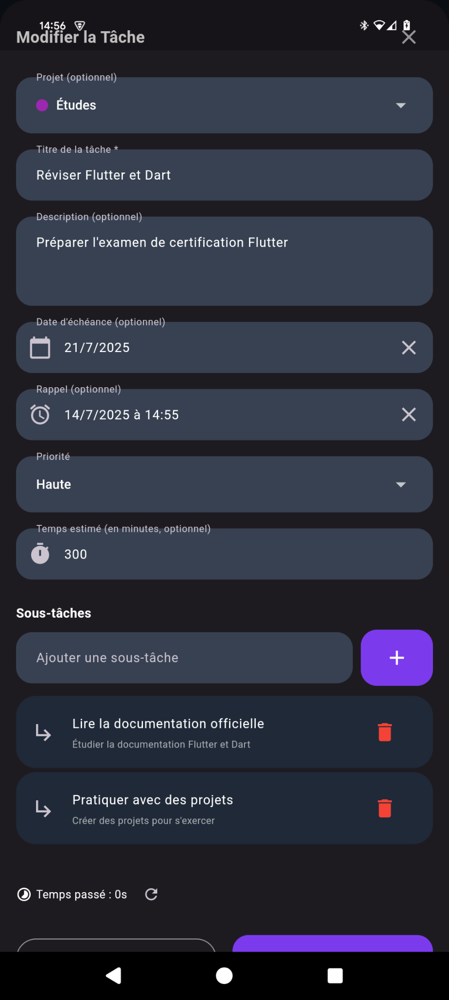
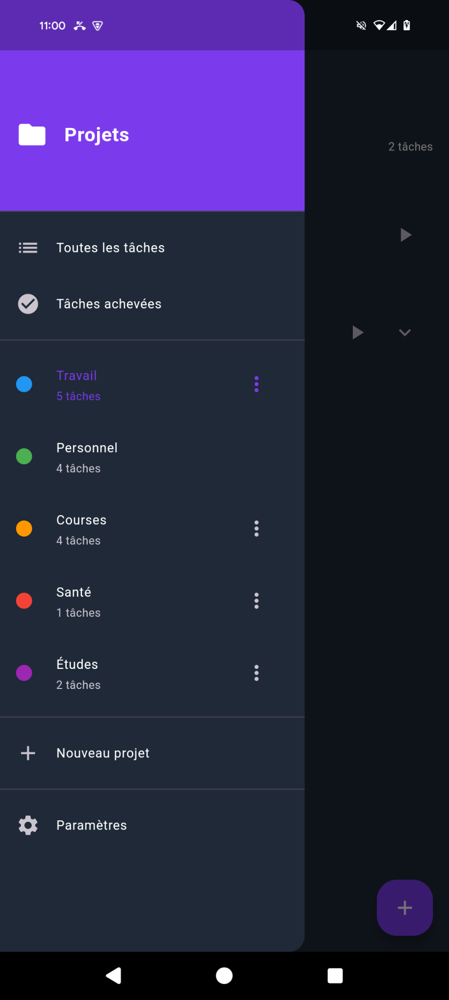

# Todo App - Application de gestion et suivi des tâches

Une application de gestion de tâches intuitive, offrant une expérience utilisateur fluide avec des fonctionnalités de suivi du temps pasés sur chaque tâche, rappels, etc.


## Fonctionnalités détaillées

### Gestion des tâches
- ✅ Création de tâches avec titre, description, priorité
- ✅ Sous-tâches hiérarchiques (3 niveaux max)
- ✅ Dates d'échéance avec rappels
- ✅ Marquage rapide comme terminée
- ✅ Suppression avec confirmation
- ✅ Édition complète des propriétés

### Système de projets
- ✅ Création de projets avec couleurs personnalisées
- ✅ Vue "Toutes les tâches" pour vue d'ensemble
- ✅ Comptage des tâches non terminées
- ✅ Gestion des projets (ajout, suppression)

### Suivi du temps
- ✅ Timer intégré par tâche
- ✅ Temps estimé vs temps réel
- ✅ Pause/reprise du timer
- ✅ Affichage en temps réel
- ✅ Statistiques de temps

### Notifications
- ✅ Rappels programmables
- ✅ Navigation directe depuis notification
- ✅ Gestion des permissions
- ✅ Notifications persistantes

### Personnalisation
- ✅ 8 thèmes de couleurs disponibles
- ✅ Mode sombre/clair
- ✅ Animations fluides
- ✅ Paramètres d'affichage

## Captures d'écran

<div align="center">
  <table>
    <tr>
      <td><strong>Écran principal</strong></td>
      <td><strong>Ajout de tâche</strong></td>
      <td><strong>Modification de tâche</strong></td>
      <td><strong>Gestion des projets</strong></td>
    </tr>
    <tr>
      <td></td>
      <td></td>
      <td></td>
      <td></td>
    </tr>
  </table>
</div>

## Installation

### Prérequis
- Flutter SDK 3.5.4 ou supérieur
- Dart 3.5.4 ou supérieur
- Android Studio / VS Code
- Un appareil Android ou émulateur

### Étapes d'installation

1. **Cloner le repository**
```bash
git clone https://github.com/4coma/todoist-private.git
cd todoist-private
```

2. **Installer les dépendances**
```bash
flutter pub get
```

3. **Configurer l'icône personnalisée** (optionnel)
```bash
# Placer votre icône dans assets/icon/icon.png
flutter pub run flutter_launcher_icons:main
```

4. **Lancer l'application**
```bash
flutter run
```

### Build pour production

**Android APK :**
```bash
flutter build apk --release
```

**Android App Bundle :**
```bash
flutter build appbundle --release
```

## Architecture Technique

### Structure du projet
```
lib/
├── main.dart                 # Point d'entrée de l'application
├── models/                   # Modèles de données
│   ├── todo_item.dart       # Modèle de tâche
│   └── project.dart         # Modèle de projet
├── services/                 # Services métier
│   ├── local_storage_service.dart    # Gestion du stockage
│   ├── notification_service.dart     # Gestion des notifications
│   ├── timer_service.dart           # Gestion du timer
│   └── preferences_service.dart     # Gestion des préférences
├── themes.dart              # Configuration des thèmes
└── widgets/                 # Composants réutilisables
    └── modern_components.dart
```

### Technologies utilisées
- **Flutter** : Framework de développement cross-platform
- **SharedPreferences** : Stockage local des préférences
- **Awesome Notifications** : Système de notifications avancé
- **Flutter Animate** : Animations fluides et modernes
- **File Picker** : Gestion des fichiers pour export/import

### Fonctionnalités techniques
- **Architecture modulaire** avec séparation des responsabilités
- **Gestion d'état** avec StatefulWidget et setState
- **Stockage sécurisé** avec chiffrement des données
- **Notifications persistantes** avec gestion des permissions
- **Timer en temps réel** avec mise à jour de l'interface

## Configuration

### Variables d'environnement
Aucune variable d'environnement requise - l'application fonctionne entièrement en local.

### Permissions Android
```xml
<uses-permission android:name="android.permission.VIBRATE" />
<uses-permission android:name="android.permission.RECEIVE_BOOT_COMPLETED" />
<uses-permission android:name="android.permission.WAKE_LOCK" />
```

### Permissions iOS
```xml
<key>UIBackgroundModes</key>
<array>
    <string>remote-notification</string>
</array>
```


## Licence

Ce projet est sous licence MIT. Voir le fichier [LICENSE](LICENSE) pour plus de détails.

